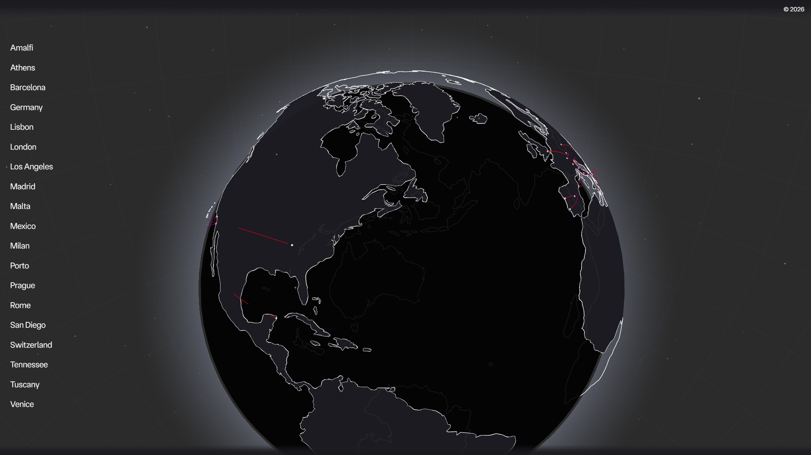
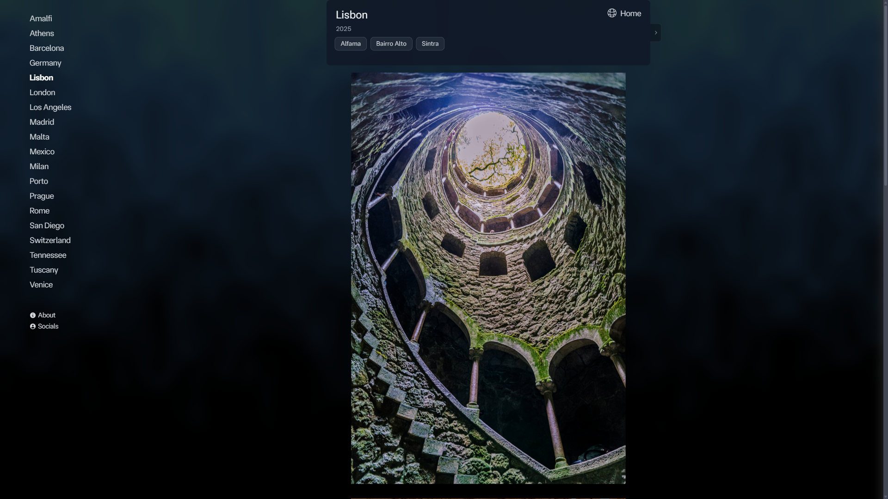

# Photos

A travel photography portfolio that lets you browse a collection of photos from around the globe. Click a photo on the rotating 3D globe and you land in a gallery for that destination, with EXIF details on every shot. HDR images lean on the browser's own tone mapping rather than faking it with CSS filters.

## Screenshots

Home page with the interactive globe:



An album page with the photo gallery:



## Features

* A 3D globe that spins, with clickable locations
* HDR capable images, so the browser handles tone mapping instead of CSS filters faking it
* EXIF badges on hover that show focal length, aperture, shutter speed, and ISO
* Albums organized geographically and served from a Cloudflare R2 bucket
* Runs as a static site or with server rendering

## Tech stack

* Next.js 14 with the App Router
* TypeScript
* Tailwind CSS
* three.js with react-globe.gl for the main globe, and Cobe for the small globe on the about page
* framer-motion for animation
* sharp and libavif for the image optimization scripts

## Getting started

You need Node.js 20 or newer.

```sh
git clone https://github.com/21sean/photos.git
cd photos
npm install
npm run dev
```

Once the dev server is up, open http://localhost:3000 in your browser.

## Scripts

* `npm run dev` starts the development server
* `npm run build` builds the app for production
* `npm run build:static` produces a static export at `out/`
* `npm run start` serves a production build
* `npm run lint` runs ESLint
* `npm run check` compiles TypeScript without emitting anything
* `npm run format` and `npm run format:fix` check and fix formatting with Prettier
* `npm run knip` reports unused files, exports, and dependencies

## Project structure

```
src/
  app/                Next.js App Router pages
    [slug]/           album pages (server page plus client view)
    about/            about page
    layout.tsx        root layout and metadata
    page.tsx          home page with the globe
    globals.css       global styles
  lib/
    albums.ts         album metadata (titles, coordinates, cities)
    photos.ts         loads the generated photos.json manifest
    data.ts           album accessors used by the pages
    slug.ts           turns a title into a URL slug
    r2.ts             builds Cloudflare R2 image URLs
    nav.tsx           site navigation
    globes/           main globe, mini globe, album list, album card
    images/           HDR image, single column gallery, iOS memory cleanup
    fx/               canvas and shader backgrounds, scroll reveal, noise
    icons/            small SVG icons
  hooks/              window size and HDR setup hooks
  data/               land geometry for the globe
  types/              shared TypeScript types
  fonts/              variable font
```

## Photo data

Your photos live in a Cloudflare R2 bucket. Album metadata is entered by hand in `src/lib/albums.ts`, while the photo list for each album is read from `src/lib/photos.json`, which is generated from the bucket rather than edited directly.

### Rebuilding the manifest

```sh
npm run sync:photos
```

This runs `scripts/sync-photos.js`, which lists the bucket, pulls EXIF and HDR metadata (dimensions, ISO, aperture, shutter speed, focal length, date, and GPS when present), and writes `src/lib/photos.json`.

```sh
node scripts/sync-photos.js --quick    # skip EXIF for speed
node scripts/sync-photos.js --dry-run  # preview without writing
```

There is also `scripts/build-photos-manifest.sh`, which builds the same manifest straight from the bucket with rclone.

### Web optimized images

Original images in the bucket can be heavy, so the optimizer builds size capped AVIF copies under a `web/` prefix and keeps wide gamut and HDR color wherever it can. For full 10 bit AVIF support, a Docker image bundles libavif so the encoder is always available.

```sh
npm run optimize:web         # encode and upload
npm run optimize:web:dry     # preview only
npm run optimize:web:force   # overwrite what is already there
npm run optimize:docker:build
npm run optimize:docker
```

### Other scripts

* `scripts/migrate-to-r2.js` uploads source images into the bucket
* `scripts/enrich-photo-ai.js` writes an AI description and a location guess for a single photo
* `scripts/update-cache-headers.js` refreshes cache headers on existing objects
* `scripts/test-r2.js` checks bucket connectivity
* `scripts/webp.sh` converts images to WebP locally

Every script reads credentials from `scripts/.env` or a root `.env` (CF_URL, Access_Key_ID, Secret_Access_Key).

## Deployment

The site builds to a static export and ships through GitHub Pages. The workflow in `.github/workflows/nextjs.yaml` runs on every push to the main branch.

```sh
npm run build:static   # writes the static site to out/
```

If you would rather run it with a server:

```sh
npm run build
npm run start
```

## License

Copyright 2026 Sean P. All rights reserved. The source is published for reference only, and the photographs may not be reused without written permission. See [LICENSE](./LICENSE) for the full terms.
